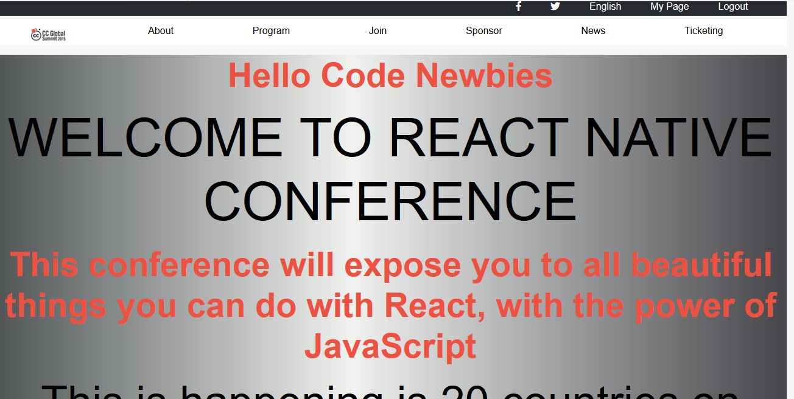

# capstone project
 

This project includes the below-mentioned pages, it's a conference website for posting of conferences.
1:-A homepage that talks about the conference
2:- About Section
3:- Ticketing Section

## Built With

- HTML,
- CSS
- Boostrap
- FontAwesome

## Getting Started

To test the code please clone the repository [here](https://github.com/haraphat01/capstone)

Run the index file with Google Chrome Browser

### Prerequisites

HTML5 and CSS3 compatible browser

### Deployment

You can use [raw githack](https://raw.githack.com/) to view this page directly from github.

You can view the site itself [here](https://raw.githack.com/haraphat01/capstone/feature/index.html) .
Have fun!

## Author

👤 **Arafat Akata**

- Github: [@haraphat01](https://github.com/haraphat01)

## 🤝 Contributing

Contributions, issues and feature requests are welcome!

Feel free to check the [issues page](issues/).

## Show your support

Give a ⭐️ if you like this project!

## Acknowledgments

- Microverse

- Special Thanks to -[Behance](https://www.behance.net/adagio07) for making this project availabe.

## 📝 License

